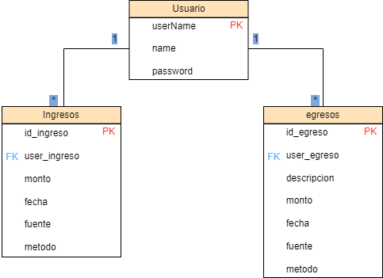

# ContAPP - Aplicación de Control de Finanzas

## Descripción del proyecto

ContAPP es una aplicación sencilla diseñada para manejar el control de ingresos y egresos personales. Los usuarios pueden registrarse, iniciar sesión y gestionar sus finanzas a través de un sistema de login seguro. Esta aplicación incluye la funcionalidad para agregar ingresos, egresos, y obtener un balance actualizado. 

- **Versión de Node.js**: 18.16.0
- **Frontend**: React
- **Backend**: Node.js y Express

### Estructura de la base de datos


## Cómo clonar el repositorio

```bash
git clone https://github.com/ADEP-123/loginSQLREACTNODE.git
cd contAPP
```

## Cómo instalar las dependencias

### Backend

```bash
cd backend
npm install
```

### Frontend

```bash
cd frontend
npm install
```

## Cómo iniciar el Backend y el Frontend

### Backend

1. Revizar que el archivo `.env` en la carpeta `backend` tenga las variables de entorno de su sistema (base de datos, puerto, etc.).
2. Asegurarse de que la base de datos esté configurada correctamente siguiendo el script de base de datos en `backend/script`.
3. Iniciar el servidor backend:

```bash
cd backend
npm run dev
```

El backend estará disponible en: `http://127.9.63.7:5000/contAPP/`

### Frontend

Para iniciar el frontend, usar el siguiente comando:

```bash
cd frontend
npm start
```

El frontend estará disponible en: `http://localhost:3000`

## Cómo interactuar con el Backend desde los Endpoints

A continuación se listan los endpoints disponibles para interactuar con la API del backend.


### **Login**

- **Endpoint**: `GET http://127.9.63.7:5000/contAPP/login`
- **Descripción**: Se envían los datos de `user` y `pass` por query para obtener el JWT.

**Ejemplo**:
```bash
curl -X GET "http://127.9.63.7:5000/contAPP/login?user=adep123&pass=ADEPadep123456"
```

**Respuesta**:
```json
{
  "token": "eyJhbGciOiJIUzI1NiIsInR5cCI6IkpXVCJ9..."
}
```

---

### **Obtener ingresos**

- **Endpoint**: `GET http://127.9.63.7:5000/contAPP/get/ingresos`
- **Descripción**: Obtener todos los ingresos del usuario autenticado.

**Ejemplo**:
```bash
curl -X GET "http://127.9.63.7:5000/contAPP/get/ingresos" \
-H "Authorization: token"
```

**Respuesta**:
```json
[
  {
    "id_ingreso": 1,
    "user_ingreso": "adep123",
    "monto": 1500.00,
    "fecha": "2024-10-06 14:23:00",
    "fuente": "Salario",
    "metodo": "Transferencia"
  },
  {
    "id_ingreso": 2,
    "user_ingreso": "adep123",
    "monto": 200.00,
    "fecha": "2024-10-07 10:12:00",
    "fuente": "Venta de productos",
    "metodo": "Efectivo"
  }
]
```

---

### **Obtener egresos**

- **Endpoint**: `GET http://127.9.63.7:5000/contAPP/get/egresos`
- **Descripción**: Obtener todos los egresos del usuario autenticado.

**Ejemplo**:
```bash
curl -X GET "http://127.9.63.7:5000/contAPP/get/egresos" \
-H "Authorization: token"
```

**Respuesta**:
```json
[
  {
    "id_ingreso": 1,
    "user_ingreso": "adep123",
    "descripcion": "Compra de materiales",
    "monto": 300.00,
    "fecha": "2024-10-07 08:30:00",
    "fuente": "Proveedores",
    "metodo": "Tarjeta de crédito"
  },
  {
    "id_ingreso": 2,
    "user_ingreso": "adep123",
    "descripcion": "Pago de servicios",
    "monto": 150.00,
    "fecha": "2024-10-07 09:45:00",
    "fuente": "Servicios Públicos",
    "metodo": "Efectivo"
  }
]
```

---

### **Obtener balance**

- **Endpoint**: `GET http://127.9.63.7:5000/contAPP/get/balance`
- **Descripción**: Obtener el balance actual del usuario autenticado (ingresos - egresos).

**Ejemplo**:
```bash
curl -X GET "http://127.9.63.7:5000/contAPP/get/balance" \
-H "Authorization: token"
```

**Respuesta**:
```json
{
  "balance": 1750.00
}
```

---

### **Obtener username**

- **Endpoint**: `GET http://127.9.63.7:5000/contAPP/get/username`
- **Descripción**: Obtener el `username` del usuario autenticado.

**Ejemplo**:
```bash
curl -X GET "http://127.9.63.7:5000/contAPP/get/username" \
-H "Authorization: token"
```

**Respuesta**:
```json
{
  "username": "adep123"
}
```

---

### **Registrar nuevo usuario**

- **Endpoint**: `POST http://127.9.63.7:5000/contAPP/post/user`
- **Descripción**: Registrar un nuevo usuario enviando los datos `username`, `name` y `password`.

**Ejemplo**:
```bash
curl -X POST "http://127.9.63.7:5000/contAPP/post/user" \
-H "Content-Type: application/json" \
-d '{
  "username": "nuevoUsuario",
  "name": "Juan Pérez",
  "password": "SuperSegura12345"
}'
```

**Respuesta**:
```json
{
  "message": "Usuario creado exitosamente"
}
```

---

### **Agregar ingreso**

- **Endpoint**: `POST http://127.9.63.7:5000/contAPP/post/income`
- **Descripción**: Registrar un nuevo ingreso.

**Ejemplo**:
```bash
curl -X POST "http://127.9.63.7:5000/contAPP/post/income" \
-H "Authorization: token" \
-H "Content-Type: application/json" \
-d '{
  "username": "adep123",
  "monto": 2500.00,
  "fuente": "Freelance",
  "metodo": "Cheque"
}'
```

**Respuesta**:
```json
{
  "message": "Ingreso agregado exitosamente"
}
```

---

### **Agregar egreso**

- **Endpoint**: `POST http://127.9.63.7:5000/contAPP/post/outcome`
- **Descripción**: Registrar un nuevo egreso.

**Ejemplo**:
```bash
curl -X POST "http://127.9.63.7:5000/contAPP/post/outcome" \
-H "Authorization: token" \
-H "Content-Type: application/json" \
-d '{
  "username": "adep123",
  "descripcion": "Compra de alimentos",
  "monto": 100.00,
  "fuente": "Supermercado",
  "metodo": "Efectivo"
}'
```

**Respuesta**:
```json
{
  "message": "Egreso agregado exitosamente"
}
```

---

### **Validar token**

- **Endpoint**: `GET http://127.9.63.7:5000/contAPP/valtoken`
- **Descripción**: Validar si el token JWT es válido.

**Ejemplo**:
```bash
curl -X GET "http://127.9.63.7:5000/contAPP/valtoken" \
-H "Authorization: token"
```

**Respuesta**:
```json
{
  "valid": true
}
```